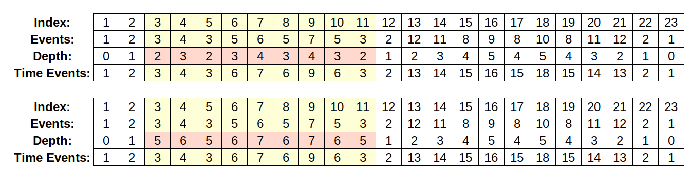

# Dynamic Diameter

## Problem Statement

You're given a tree with $N$ nodes and $N - 1$ edges connecting each of the nodes. Each edge is a tuple $(u[i], v[i], c[i])$, connecting node $u[i]$ and $v[i]$ with weight $c[i]$ $(0 \leq i \leq n - 2)$.

You're given $Q$ queries:

- `1`, output the largest diameter of the tree, followed with two nodes $x$ and $y$ denoting the endpoints of the diameter.
- `2 x`, output the distance between $x$ and $y$, where $y$ is the node with furthest distance from $x$, output the $y$ as well.
- `3 x v` change the cost of $c[x] := v$ .

## Vocabs

I will use the word **highest/higher/high** to refer the node that is closer to the root, and **deepest/deeper/deep** to refer the node that is further from the root.

## Centroid Decomposition Solution

### Building the Centroid Tree and Getting The Query

#### Lemma 1

```
Diameter of a tree is the distance between two furthest nodes in the tree. Let's say the diameter pair is (x, y), when adding a new point u, the new diameter pair is either (x, y), (x, u) or (u, y).
```

#### Lemma 2

```
For each node in u, the furthest node from u is either x or y, where the diameter pair of the tree is (x, y). 
```

WLOG, let's root the original tree at $1$. Define $depth[x]$ as the distance of a node $x$ in the tree from the root, where $depth[1] = 0$. 

You might approach this problem with centroid decomposition, we can use the property where the LCA (lowest common ancestor) of two nodes $x$ and $y$ in the centroid tree, let's call it $lca$, have this property of $distance(x, lca) + distance(y, lca) = distance(x, y)$ in the real tree as well.

To solve this problem, for each node $u$ in the centroid tree we will keep a set called $bestMatch$, containing $(furthestDistance, v, x)$, where $v$ is the furthest distance of $u$ to any of the subtree of node $v$, and we will store $v$ where $v$ is the direct children of node $u$, and $x$ is the respectable node where $x$ to $u$ is the furthest.

Let's claim this build method is true:

```c++
decompose(x):
  x = findCentroid(x);
  for (child : edge[x]):
    edge[child].erase(x);
    edge[x].erase(child);
    nextCentroid = decompose(child);
    centroidEdge[x].push(nextCentroid)
  return x;

root = decompose(1);
set bestDiameter;
set[] bestMatch;
pair[] diameterPair;

buildTree(x):
    diameterPair[x] = {x, x};
  bestDiameter[x] = 0
  for(child : centroidEdge[x])
    buildTree(child)
        // Use lemma 2, to get bestMatch or furthest node for x in the subtree of child,
        // just compare them with the diameter
        bestMatch[x] = compareBestMatch(diameterPair[child][0], diameterPair[child][1])
    // Use lemma 1, Adjust the bestDiameter value as well in this 
    diameterPair[x] = compareBestDiameter(diameterPair[x],
                                              diameterPair[child]);
  if(size(bestMatch[x]) > 1):
    diameterPair[x] = compareBestDiameter(diameterPair[x],
                                              (bestMatch[x][0], bestMatch[x][1]));
    else:
    diameterPair[x] = compareBestDiameter(diameterPair[x],
                                              (bestMatch[x][0], x));
```

Sadly, as for now, the distance between two nodes in a tree can only be computed with Heavy Light Decomposition with edge update:

- Can update edge weight
- Can count the distance between two nodes

Which will result this algorithm to have the time complexity $O(N \log^2 N)$.

----

For the implementation details and debugging: Let's look at this random example. Consider this unweighted tree (each tree's weight is $1$).


Consider the centroid decomposition of this tree, if we see here, the node $2$ in the centroid tree will store:

- $bestMatch[2] = \{(1, 1, 1), (4, 8, 10), (3, 5, 6)\}$
  - $(\textcolor{red}{1}, \textcolor{blue}{1}, \textcolor{green}{1})$ means for this child $ \textcolor{blue}{1}$, we can get the maximum distance of $\textcolor{red}{1}$, by going to the node $\textcolor{green}{1}$.
  - $(\textcolor{red}{4}, \textcolor{blue}{8}, \textcolor{green}{10})$ means for this child $ \textcolor{blue}{8}$, we can get the maximum distance of $\textcolor{red}{4}$, by going to the node $\textcolor{green}{10}$.
    - This is correct because if you see in the original tree, the distance of $2$ to $10$ is $4$.
    - Now, this is just a simple case where the tree is unweighted, but the logic will be similar for weighted trees, it's just when computing depth, we will increase it by the edge weight instead of just $1$.

Now we will keep another set containing each node $u$ in the centroid tree, what is the maximum diameter of the tree that passes this $\boldsymbol{u}$, which can be done by matching the deepest and second deepest maximum distance we get from $bestMatch[u]$.

> Details: don't forget to consider the deepest one only in case when the size or cardinality of $bestMatch[u]$ is $1$.

Now, we can store it in the global set $bestDiameter = \{(diameter(1), 1), (diameter(2), 2), \dots (diameter(u), u)\}$, for every node $u$ ($1 \leq u \leq n$). Where diameter is the best diameter that goes through $u$ in the centroid tree.

the answer is just the best diameter, to store the two best pairs, just create another array that maps the current $u$ to its best pair.

> The same idea could be done to $bestMatch[u]$ too, we can just store the pairs $(furthestDistance, v)$ without the $x$ (previously was $(furthestDistance, v, x)$).

### Updating

Centroid tree have this property where the depth of the tree is $O(\log (N))$. Meaning when updating something, one can casually crawl up to the root within $\log N$ steps.

Updating can be tricky, when updating the edge tuple $(u, v, c)$,

Let's say we want to update the tuple to $(8, 11, 3)$, or change the weight connecting $8$ and $11$ from $1$ to $3$.

In the centroid tree, $8$ and $11$ by the property of centroid tree must have this ancestor-children relationship.

> Consider both of them is still in the same tree when decomposing, if both of them is not picked as the centroid yet, they both will still stay together. If one of them is picked, for example $u$ is picked (the other we can consider as $v$) then the tree will decompose into subtrees, which one of them contains $v$.

So here, we can just pick whichever is the shallowest in terms of depth in the centroid tree. In this case, 8 is higher in the centroid tree. We will recompute every node from $8$ to the root by using the same build method, instead of just storing the max, indeed we have to store all data to recompare at the end.

> The edge 8 and 11 wouldn't be involved in the subtree of child of 8 containing 11, so recomputation is not needed.

## Euler Tour and Segment Tree Solution

### Building The Segment Tree

Let's consider the same tree used in the centroid decomposition, let's make this euler tour decomposition based on that tree

```
12
1 2
2 3
3 4
3 5
5 6 
5 7
2 12
12 11
11 8
8 9
8 10
```


```
order[1] = (1, 23)
order[2] = (2, 22)
order[3] = (3, 11)
order[4] = (4, 4)
order[5] = (6, 10)
order[6] = (7, 7)
order[7] = (9, 9)
order[8] = (15, 19)
order[9] = (16, 16)
order[10] = (18, 18)
order[11] = (14, 20)
order[12] = (13, 21)
```

Let's talk about some property this Euler tour have.


- First we can use this euler tour to do LCA, to get the lca of two node $x$ and $y$, simply get the minimum depth from `order[x].first` and `order[y].first`, observe that the `order[x].first` is the first occurence of that certain node in the, tree, traversing to both will always pass the LCA, also observe that the euler tour event length will be $2N -  1$. See for that certain event length.

Okay now, let's observe on how to compute the diameter on unweighted tree. Let's store 5 values on the segment tree over the event node. Each event represent a single node in the tree.

```
maxDepth, minDepth, prefixDeep, suffixDeep, diameter
```

- `maxDepth` is the maximum depth for that interval.

  - This essentially means the deepest node for this current event interval.
  - Initialize this with $Depth[Events[Index]]$.
- `minDepth` is the minimum depth for that interval.

  - This essentially mean the highest node in this current height interval.
  - Observe that the node for this minDepth is always the root for this current interval

  - 

  - For example, when querying the tosca interval, if $x$ is inside them, then $x$'s depth will always be denoted as `minDepth` for that interval
  - Initialize this with $Depth[Events[Index]]$.
- `prefixDeep` is the **best ready to sum distance**, it contains the best $x$ for the current interval, where $depth[x] - 2 * depth[lca]$ is the largest, it also true that $x \leq lca$
  - Initialize this with $depth[events[index]] - 2 \times depth[events[index]]$.

- `suffixDeep` is the  **ready to sum distance**, it contains the best $y$ for the current interval where $depth[y] - 2 * depth[lca]$ is the largest, it's also true that $lca \leq y$
  - Initialize this with $depth[events[index]] - 2 \times depth[events[index]]$.


What is **ready to sum distance**?

- Denote $[Lstart, Lend]$ as the first interval and $[Rstart, Rend]$ as the second interval.
- If you pay attention to the formula, diameter of an interval is two longest pair in that interval, What happens if two interval merges? There are two possibilities: 
  - The diameter are grabbed entirely from either the first interval or second interval
  - There is a certain **node** in the first interval, There is also a **node** in the second interval, and when both the interval merged, it will become the new diameter of the interval. This will only happen, if?
    - Let's say the node in the first interval is $x$ ($Lstart \leq x \leq Lend$), and the second interval is $y$ ($Rstart \leq x \leq Rend$). This node will go to **each other** passing their **LCA**, and the **LCA** will always be the highest node between $[x, Lend]$ or is in $[Rstart, y]$.
    - Either way, when we're computing the merged diameter, we will consider the $depth[x] + depth[y] - 2 *depth[lca]$. Meaning, if we were to match the deepest $depth[y]$, we shall prepare $depth[x] - 2 *depth[lca]$, the same suffice if we were to match the deepest $depth[x]$ we shall prepare $depth[y] - 2 * depth[lca]$.

- `diameter` is just the diameter of this current interval's euler journey tree.
  - Diameter is basically $depth[a] + depth[c] - 2 \times depth[b]$, where $b$ is the lca of $a$ and $c$, but don't worry, we can just ignore this $b$, because for any arbitrary $a$ and $c$ in that interval, the minimum 

#### Example 1

This seems counterintuitive and very weird. But let's take a look of several cases


```
10 12 Computing: 
Maxdepth: (3, 5)
Mindepth: (1, 2)
prefixDeep: (-1, 2)
suffixDeep: (1, 5) (This basically prepares the pair (depth[5] - 2 * depth[2]))
diameter (2, (5, 2))

13 14 Computing: 
Maxdepth: (3, 11) (Will try to match this with the suffixDeep of [10, 12] (depth[11] will be paired with (depth[5] - 2 * depth[2])))
Mindepth: (2, 12)
prefixDeep: (-1, 11) (Prefix is depth[11] - 2 * depth[12])
suffixDeep: (-2, 12) (Suffix also have depth[12] - 2 * depth[12]). Why not depth[12] - 2 * depth[11]? because suffix should be left depth max - 2 * right depth min 
diameter (1, (11, 12))

10 14 Computing: 
Maxdepth: (3, 11)
Mindepth: (1, 2)
prefixDeep: (1, 11)
suffixDeep: (1, 5)
diameter (4, (11, 5)) (this is the result)
```

#### Example 2


```
3 5 Computing: 
Maxdepth: (2, 3)
Mindepth: (0, 1)
prefixDeep: (0, 1)
suffixDeep: (2, 3) (Check this one out, this is depth[3] - 2 * depth[0])
diameter (2, (3, 1))

// Case [3, 6] is the same
3 6 Computing: 
Maxdepth: (2, 3)
Mindepth: (0, 1)
prefixDeep: (1, 4)
suffixDeep: (2, 3)
diameter (3, (3, 4))

// [7, 8] is obvious, if you think, should be using 5 -> 4 as the suffix
7 8 Computing: 
Maxdepth: (2, 5)
Mindepth: (1, 4)
prefixDeep: (-1, 4)
suffixDeep: (0, 5)
diameter (1, (5, 4))

// Now what happens when we merge [3, 6] and [7, 8]
3 8 Computing: 
Maxdepth: (2, 5)
Mindepth: (0, 1)
prefixDeep: (2, 5)
suffixDeep: (2, 3) (Still using 3 -> 2 -> 1, because depth[3] - 2 * depth[1] > depth[5] - 2 * depth[4]).
diameter (4, (3, 5))

```


Smart, instead of extending the diameter with $5 \rightarrow 4, ...,$ it's actually better if we use $3 \rightarrow 2 \rightarrow 1$, and merge it with $maxDepth$ from the right segment.

If you think about it again, if we add the edge $(5, 8)$, $depth[8]$ will not suffice to replace $suffixDeep$, but if we again add $(8, 9)$, $depth[9] - 2 \times depth[4] = depth[3] - 2 \times depth[1]$ has the same ready to sum distance! When the tree is weighted, This invariant is still correct.

Based on that information, we can maintain the information for each of the interval using this merge method. 

```c++
void merge(Node &head, Node &l, Node &r) {
  head.maxDepth = max(l.maxDepth, r.maxDepth);
  head.minDepth = min(l.minDepth, r.minDepth);

  head.suffixDeep = max(l.suffixDeep, r.suffixDeep);
  head.suffixDeep = max(head.suffixDeep, l.maxDepth - 2 * r.minDepth);

  head.prefixDeep = max(l.prefixDeep, r.prefixDeep);
  head.prefixDeep = max(head.prefixDeep, r.maxDepth - 2 * l.minDepth);

  head.diameter = max(l.diameter, r.diameter);
  head.diameter = max(head.diameter, l.maxDepth + r.prefixDeep);
  head.diameter = max(head.diameter, r.maxDepth + l.suffixDeep);
}
```

### Update and Lazy Propagation

Now, let's think on how to update a certain edge's weight, let's say we want to update $(u, v, +c)$, WLOG, let's consider the update as a delta between the old weight and the new weight. WLOG, assume $depth[u] < depth[v]$ ($v$ is deeper and $u$ is closer to the root) What we're doing is basically increasing the depth for all the subtree of $v$. For example we are increase the weight of $(2, 3)$ by $3$, we will update the interval $[order[3].first, order[3].second]= [3, 11]$ in this case by $+3$, the propagation is easy, because:

- It doesn't affect the diameter of that current subtree, it only affects the diameter pair for the range that:
  - Starts with an index $L < order[3].first$, and ends with index $order[3].first \leq R \leq order[3].second$.
  - Starts with an index $order[3].first \leq L \leq order[3].second$ and ends with index  $order[3].second < R$.
- The lazy propagation for that certain interval thus only affects `maxDepth`  and `minDepth` (just an increase of $+c$), `prefixDeep` and `suffixDeep` (decrease of $c$).

```c++
void pushDown(int rangeL = 1, int rangeR = dfsTime, int idx = 1) {
  if (segt[idx].lazy == 0) return;
  auto &val = segt[idx].lazy;
  segt[idx].maxDepth += val;
  segt[idx].minDepth += val;
  segt[idx].suffixDeep -= val;
  segt[idx].prefixDeep -= val;
  if (rangeL != rangeR) {
    segt[idx * 2].lazy += val;
    segt[idx * 2 + 1].lazy += val;
  }
  val = 0;
  return;
}
```

By this, the invariant of that interval is maintained accordingly after pushing down a node. The parent node then can merge and adjust again.



### Obtaining the Diameter Pair

The main observation doesn't actually change, **the pushdown is not modified**, we just need to keep track which node is involved during obtaining the diameter of the tree.

```c++
void merge(Node &head, Node &l, Node &r) {
  head.maxDepth = max(l.maxDepth, r.maxDepth);
  head.minDepth = min(l.minDepth, r.minDepth);
    
  head.prefixDeep = max(l.prefixDeep, r.prefixDeep);
  head.prefixDeep = max(head.prefixDeep, {r.maxDepth.fi - 2 * l.minDepth.fi, r.maxDepth.se});

  head.suffixDeep = max(l.suffixDeep, r.suffixDeep);
  head.suffixDeep = max(head.suffixDeep, {l.maxDepth.fi - 2 * r.minDepth.fi, l.maxDepth.se});

  head.diameter = max(l.diameter, r.diameter);
  head.diameter = max(head.diameter, {l.maxDepth.fi + r.prefixDeep.fi, {l.maxDepth.se, r.prefixDeep.se}});
  head.diameter = max(head.diameter, {r.maxDepth.fi + l.suffixDeep.fi, {r.maxDepth.se, l.suffixDeep.se}});
}
```

### Getting Furthest Node From X

By getting the diameter pair, essentially you can just plugin another HLD to get $max(distance(X, pair[0]), distance(Y, pair[1]))$. But that's just dumb, we can just get the LCA and compute it by getting it using your classic $depth[x] + depth[y] - 2\times depth[lca]$. By the time you realize this, yes, you can also use this data structure to do dynamic update on weight, and get distance of two node in the tree..

```c++
namespace DynamicDiameter {
vector <PLL> edge[LIM + 5];
int event[2 * LIM + 5];
int dfsTime = 0;
LL weights[LIM + 5], depth[LIM + 5];
PLL order[LIM + 5];
void eulerTour(int pos, int par = -1) {
  dfsTime++;
  order[pos].fi = dfsTime;
  event[dfsTime] = pos;
  for (auto &nx : edge[pos]) {
    if (nx.fi == par) continue;
    depth[nx.fi] = depth[pos] + nx.se;
    weights[nx.fi] = nx.se;
    eulerTour(nx.fi, pos);
    dfsTime++;
    event[dfsTime] = pos;
  }
  order[pos].se = dfsTime;
  return;
}

const LL INF = 1e14;
// Segment Tree starts here
struct Node {
  PLL maxDepth = { -INF, -1}, minDepth = {INF, -1};
  PLL prefixDeep = { -INF, -1}, suffixDeep = { -INF, -1};
  LL eventTime = INF;
  pair<LL, PLL> diameter = { -1, { -1, -1}};
  LL lazy;
};

Node segt[8 * LIM + 5];
void pushDown(int rangeL = 1, int rangeR = dfsTime, int idx = 1) {
  if (segt[idx].lazy == 0) return;
  auto &val = segt[idx].lazy;
  segt[idx].maxDepth.fi += val;
  segt[idx].minDepth.fi += val;
  segt[idx].prefixDeep.fi -= val;
  segt[idx].suffixDeep.fi -= val;
  if (rangeL != rangeR) {
    segt[idx * 2].lazy += val;
    segt[idx * 2 + 1].lazy += val;
  }
  val = 0;
  return;
}

void merge(Node &head, Node &l, Node &r) {
  head.maxDepth = max(l.maxDepth, r.maxDepth);
  head.minDepth = min(l.minDepth, r.minDepth);

  head.prefixDeep = max(l.prefixDeep, r.prefixDeep);
  head.prefixDeep = max(head.prefixDeep, {r.maxDepth.fi - 2 * l.minDepth.fi, r.maxDepth.se});

  head.suffixDeep = max(l.suffixDeep, r.suffixDeep);
  head.suffixDeep = max(head.suffixDeep, {l.maxDepth.fi - 2 * r.minDepth.fi, l.maxDepth.se});

  head.diameter = max(l.diameter, r.diameter);
  head.diameter = max(head.diameter, {l.maxDepth.fi + r.prefixDeep.fi, {l.maxDepth.se, r.prefixDeep.se}});
  head.diameter = max(head.diameter, {r.maxDepth.fi + l.suffixDeep.fi, {r.maxDepth.se, l.suffixDeep.se}});

  head.eventTime = min(l.eventTime, r.eventTime);
  //~ cout << head.maxDepth << " " << head.minDepth << " " << head.suffixDeep << " " << head.prefixDeep << " " << head.diameter << endl;
}
void build(int rangeL = 1, int rangeR = dfsTime, int idx = 1) {
  //~ cout << rangeL << " " << rangeR << " " << idx << endl;
  if (rangeL == rangeR) {
    segt[idx].minDepth = segt[idx].maxDepth = {depth[event[rangeL]], event[rangeL]};
    segt[idx].suffixDeep = segt[idx].prefixDeep = { -depth[event[rangeL]], event[rangeL]};
    segt[idx].diameter = {0, {event[rangeL], event[rangeL]}};
    segt[idx].eventTime = order[event[rangeL]].fi;
    return;
  }
  int mid = (rangeL + rangeR) >> 1;
  build(rangeL, mid, idx * 2);
  build(mid + 1, rangeR, idx * 2 + 1);
  merge(segt[idx], segt[idx * 2], segt[idx * 2 + 1]);
}
void update(int queryL, int queryR, LL val, int rangeL = 1, int rangeR = dfsTime, int idx = 1) {
  pushDown(rangeL, rangeR, idx);
  if (rangeR < queryL) return;
  if (queryR < rangeL) return;
  if (queryL <= rangeL && rangeR <= queryR) {
    segt[idx].lazy = val;
    pushDown(rangeL, rangeR, idx);
    return;
  }
  int mid = (rangeL + rangeR) >> 1;
  update(queryL, queryR, val, rangeL, mid, idx * 2);
  update(queryL, queryR, val, mid + 1, rangeR, idx * 2 + 1);
  merge(segt[idx], segt[idx * 2], segt[idx * 2 + 1]);
  return;
}

int getLcaQuery(int queryL, int queryR, int rangeL = 1, int rangeR = dfsTime, int idx = 1) {
  pushDown(rangeL, rangeR, idx);
  if (rangeR < queryL) return INT_MAX;
  if (queryR < rangeL) return INT_MAX;
  if (queryL <= rangeL && rangeR <= queryR) {
    return segt[idx].eventTime;
  }
  int mid = (rangeL + rangeR) >> 1;
  auto lchild = getLcaQuery(queryL, queryR, rangeL, mid, idx * 2);
  auto rchild = getLcaQuery(queryL, queryR, mid + 1, rangeR, idx * 2 + 1);
  return min(lchild, rchild);
}
int getDepthQuery(int query, int rangeL = 1, int rangeR = dfsTime, int idx = 1) {
  pushDown(rangeL, rangeR, idx);
  if (rangeR < query) return INT_MAX;
  if (query < rangeL) return INT_MAX;
  if (rangeL == rangeR) {
    return segt[idx].maxDepth.fi;
  }
  int mid = (rangeL + rangeR) >> 1;
  auto lchild = getDepthQuery(query, rangeL, mid, idx * 2);
  auto rchild = getDepthQuery(query, mid + 1, rangeR, idx * 2 + 1);
  return min(lchild, rchild);
}

int getLca(int a, int b) {
  if(order[a].fi > order[b].fi) swap(a, b);
  int minEventTime = getLcaQuery(order[a].fi, order[b].fi);
  return event[minEventTime];
}

int getDistance(int a, int b) {
  int lca = getLca(a, b);
  // cout << "here " << a << " " << b << " " << lca << endl;
  return getDepthQuery(order[a].fi) + getDepthQuery(order[b].fi) - 2 * getDepthQuery(order[lca].fi);
}

void assignEdgeWeight(int x, LL val) {
  update(order[x].fi, order[x].se,  val - weights[x]);
  weights[x] = val;
}
void assignEdgeWeight(int a, int b, LL val) {
  if (order[a].fi > order[b].fi) swap(a, b);
  assignEdgeWeight(b, val);
}
Node get(int queryL, int queryR, int rangeL = 1, int rangeR = dfsTime, int idx = 1) {
  pushDown(rangeL, rangeR, idx);
  if (rangeR < queryL) return Node();
  if (queryR < rangeL) return Node();
  if (queryL <= rangeL && rangeR <= queryR) {
    return segt[idx];
  }
  int mid = (rangeL + rangeR) >> 1;
  auto lchild = get(queryL, queryR, rangeL, mid, idx * 2);
  auto rchild = get(queryL, queryR, mid + 1, rangeR, idx * 2 + 1);
  auto res = Node();
  merge(res, lchild, rchild);
  return res;
}
}

```

## Other Problem Variation

- Get Subtree Diameter
- Get Furthest node for a certain $x$ under a subtree